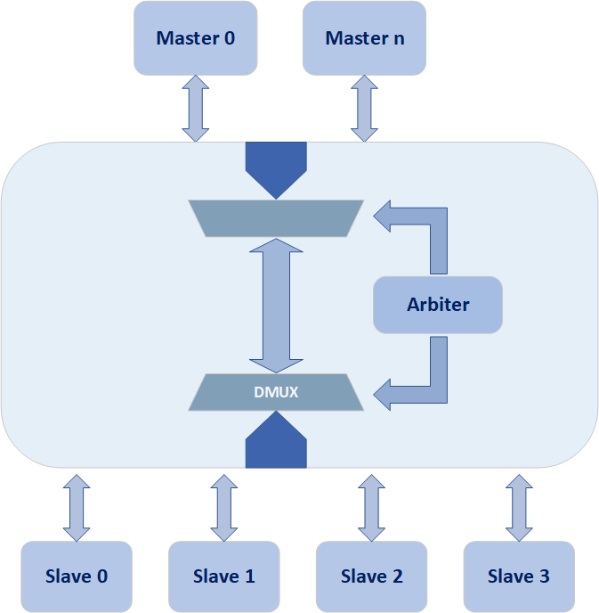
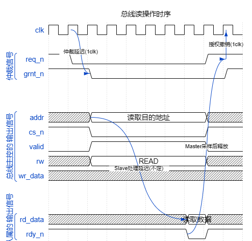
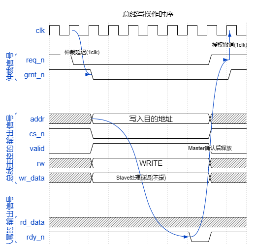
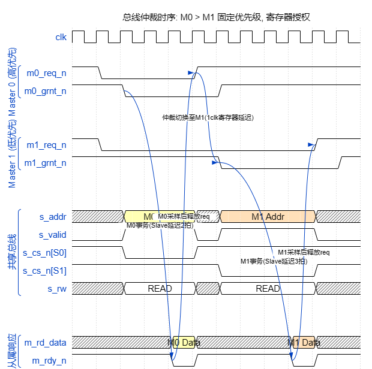

# SimpleRISC-V Bus 设计说明

> 本文档由 AI 辅助撰写，基于 RTL 源码分析生成。如有与实际代码不符之处，以 RTL 为准。

## 1. 概述

本文档说明 `simpleRISC-V` 项目中共享总线模块的接口定义、内部逻辑和工作流程。

当前总线设计具有以下特征：

- 地址宽度为 32 位，采用字节地址。
- 数据宽度为 32 位。
- 支持 `4` 个主设备（Master）。
- 支持 `8` 个从设备（Slave）。
- 仲裁方式为固定优先级仲裁，编号越小优先级越高。
- 当前总线拥有者在请求保持有效时不会被中途抢占（非抢占式）。
- 共享地址/控制/写数据总线，以及返回读数据/就绪信号，采用多路选择器建模。
- 控制信号大量采用低有效约定。

总体架构如图所示：

总线相关源码位于：

- `src/bus/bus_top.v`
- `src/bus/bus_arbiter.v`
- `src/bus/bus_master_mux.v`
- `src/bus/bus_addr_dec.v`
- `src/bus/bus_slave_mux.v`

---

## 2. 顶层模块说明

顶层模块为 `bus_top`，负责把仲裁器、主设备侧多路选择器、地址译码器和从设备返回通路连接起来。

模块功能划分如下：

- `bus_arbiter`：对多个 Master 的请求进行仲裁，输出授权（寄存器输出）。
- `bus_master_mux`：将获得授权的 Master 的地址、控制和写数据通过多路选择器驱动到共享总线上。
- `bus_addr_dec`：根据共享地址和 `s_valid` 信号生成从设备片选。
- `bus_slave_mux`：把被片选 Slave 的读数据和 `rdy_n` 信号通过多路选择器返回给 Master 侧。

---

## 3. 总线参数

默认参数如下：

| 参数名        | 默认值 | 说明               |
| ------------- | -----: | ------------------ |
| `NUM_MASTERS` |    `4` | Master 数量        |
| `NUM_SLAVES`  |    `8` | Slave 数量         |
| `ADDR_W`      |   `32` | 地址宽度，字节地址 |
| `DATA_W`      |   `32` | 数据宽度           |
| `IDX_MSB`     |   `31` | Slave 编号译码高位 |
| `IDX_LSB`     |   `29` | Slave 编号译码低位 |

在默认配置下，地址 `addr[31:29]` 用于选择从设备编号，共可映射 8 个 Slave。

---

## 4. 顶层 IO 说明

### 4.1 时钟与复位

| 信号名  | 方向  | 位宽 | 说明           |
| ------- | ----- | ---: | -------------- |
| `clk`   | input |    1 | 系统时钟       |
| `rst_n` | input |    1 | 异步低有效复位 |

### 4.2 Master 侧接口

| 信号名      | 方向   |                   位宽 | 说明                         |
| ----------- | ------ | ---------------------: | ---------------------------- |
| `m_req_n`   | input  |          `NUM_MASTERS` | Master 请求总线，低有效      |
| `m_grnt_n`  | output |          `NUM_MASTERS` | 仲裁授权，低有效，寄存器输出 |
| `m_addr`    | input  | `NUM_MASTERS * ADDR_W` | 各 Master 打包后的地址输入   |
| `m_valid`   | input  |          `NUM_MASTERS` | 事务有效，高有效             |
| `m_rw`      | input  |          `NUM_MASTERS` | 读写控制，`1` 为读，`0` 为写 |
| `m_wr_data` | input  | `NUM_MASTERS * DATA_W` | 各 Master 打包后的写数据     |
| `m_rd_data` | output |               `DATA_W` | 共享返回读数据               |
| `m_rdy_n`   | output |                      1 | 共享 ready，低有效           |

说明：

- `m_addr` 与 `m_wr_data` 使用打包总线方式组织，每个 Master 占一个连续切片（`[i*WIDTH +: WIDTH]`）。
- 只有获得授权的 Master 会通过 `bus_master_mux` 驱动共享总线。
- `m_rd_data` 和 `m_rdy_n` 是所有 Master 共享的返回信号，Master 需要在自己被授权时采样。

### 4.3 Slave 侧接口

| 信号名      | 方向   |                  位宽 | 说明                           |
| ----------- | ------ | --------------------: | ------------------------------ |
| `s_addr`    | output |              `ADDR_W` | 共享地址总线                   |
| `s_valid`   | output |                     1 | 共享事务有效，高有效           |
| `s_rw`      | output |                     1 | 共享读写控制，`1` 读 `0` 写    |
| `s_wr_data` | output |              `DATA_W` | 共享写数据总线                 |
| `s_cs_n`    | output |          `NUM_SLAVES` | 各 Slave 片选，低有效          |
| `s_rd_data` | input  | `NUM_SLAVES * DATA_W` | 各 Slave 打包后的读数据输入    |
| `s_rdy_n`   | input  |          `NUM_SLAVES` | 各 Slave 的 ready 输入，低有效 |

说明：

- `s_cs_n` 仅在 `s_valid` 有效时进行地址译码，`s_valid = 0` 时所有片选保持无效。
- 从设备返回通路也是共享的，只有被片选的 Slave 才通过 `bus_slave_mux` 驱动返回总线。

### 4.4 有效电平约定

| 信号            | 有效电平   | 说明               |
| --------------- | ---------- | ------------------ |
| `rst_n`         | 低有效     | 复位               |
| `m_req_n`       | 低有效     | Master 请求        |
| `m_grnt_n`      | 低有效     | 仲裁授权           |
| `m_valid`       | **高有效** | 事务有效           |
| `s_valid`       | **高有效** | 共享事务有效       |
| `s_cs_n`        | 低有效     | Slave 片选         |
| `s_rdy_n`       | 低有效     | Slave ready        |
| `m_rdy_n`       | 低有效     | Master 侧 ready    |
| `m_rw` / `s_rw` | —          | `1` = 读，`0` = 写 |

---

## 5. 波形参考

以下 WaveDrom JSON 文件提供了总线操作的时序波形，可在 [WaveDrom Editor](https://wavedrom.com/editor.html) 中查看：

| 文件                      | 内容                             |
| ------------------------- | -------------------------------- |
| `wavedrom_bus_read.json`  | 单 Master 读事务完整时序         |
| `wavedrom_bus_write.json` | 单 Master 写事务完整时序         |
| `wavedrom_bus_arb.json`   | 双 Master 竞争仲裁与优先级链时序 |

读/写事务的关键时序特征：

- **仲裁延迟**：`req_n` 有效 → `grnt_n` 有效，固定 1 个 `clk` 周期（寄存器输出）。
- **Slave 响应延迟**：不确定，取决于 Slave 内部处理速度，至少 1 个 `clk` 周期。Master 通过轮询 `m_rdy_n` 等待。
- **授权撤销延迟**：Master 释放 `req_n` → `grnt_n` 撤销，固定 1 个 `clk` 周期。

---

## 6. 读写事务流程

### 6.1 读事务

读事务的完整时序流程如下（参见 `wavedrom_bus_read.json`）：

1. Master 拉低 `m_req_n` 发起总线请求，同时在自己的本地接口上准备好 `m_addr`、`m_valid = 1`、`m_rw = 1`。
2. **下一个 `posedge clk`**：仲裁器寄存器更新，输出对应 `m_grnt_n[i] = 0`。
3. `bus_master_mux`（组合逻辑）立即将获授权 Master 的信号送上共享总线：`s_addr`、`s_valid = 1`、`s_rw = 1`。
4. `bus_addr_dec`（组合逻辑）根据 `s_addr[31:29]` 产生对应 `s_cs_n[target] = 0`。
5. 被选中的 Slave 收到 `cs_n = 0` 和 `s_valid = 1` 后开始处理读请求。**Slave 通常无法在当拍返回数据**，因此 `s_rdy_n` 保持高电平（未就绪），Master 需要等待。
6. 经过若干周期后，Slave 完成处理，拉低 `s_rdy_n = 0` 并驱动 `s_rd_data`。
7. `bus_slave_mux`（组合逻辑）将选中 Slave 的 `rd_data` 和 `rdy_n` 送回 `m_rd_data` 与 `m_rdy_n`。
8. Master 检测到 `m_rdy_n = 0`，采样 `m_rd_data` 完成本次读访问。
9. Master 释放 `m_req_n = 1`，`m_valid = 0`。**下一个 `posedge clk`** 仲裁器取消授权。

关键约束：Master 必须保持 `m_req_n` 和 `m_valid` 稳定，直到 Slave 返回 `rdy_n = 0`。

### 6.2 写事务

写事务的时序流程与读事务类似（参见 `wavedrom_bus_write.json`），区别在于：

1. Master 设置 `m_rw = 0`（写），同时驱动 `m_wr_data`。
2. 共享总线上 `s_rw = 0`，`s_wr_data` 携带写入数据。
3. Slave 收到 `cs_n = 0`、`s_valid = 1`、`s_rw = 0` 后开始处理写请求。
4. 写入完成后，Slave 拉低 `s_rdy_n = 0` 表示写操作已接受。
5. 写事务期间 `m_rd_data` 无意义。

### 6.3 事务间隙

Master 可以在持有授权期间暂时拉低 `m_valid`（如连续传输之间的间隔），此时 `s_valid = 0`，不会触发任何 Slave 片选。只要 `m_req_n` 保持有效，仲裁器不会撤销授权。

---

## 7. 子模块逻辑说明

### 7.1 `bus_arbiter`

`bus_arbiter` 实现固定优先级、非抢占式总线仲裁。

仲裁规则如下：

1. `m0` 优先级最高，`m1` 次之，依次类推。
2. 当总线空闲或当前拥有者释放请求后，仲裁器从低编号到高编号扫描请求信号。
3. 找到第一个有效请求后，将其记录为新的拥有者。
4. 一旦某个 Master 成为当前拥有者，只要该 Master 的 `req_n` 仍保持有效，就持续持有总线（非抢占）。
5. 当前拥有者释放 `req_n` 后，仲裁器才重新扫描并选择新的拥有者。

内部实现细节：

- `owner` 寄存器记录当前总线拥有者索引。
- `owned` 寄存器标识总线当前是否有拥有者。
- `grnt_n` 为寄存器输出，在 `posedge clk` 更新，消除组合逻辑毛刺。
- 复位时 `grnt_n` 全部拉高（无授权），`owned = 0`。

### 7.2 `bus_master_mux`

`bus_master_mux` 负责把获授权 Master 的输出通过多路选择器连接到共享总线。

- 遍历所有 Master，找到 `grnt_n[i] == 0` 的 Master，将其 `addr`、`valid`、`rw`、`wr_data` 输出到共享总线。
- 无 Master 获授权时，共享总线输出默认值：`s_addr = 0`，`s_valid = 0`，`s_rw = 1`（读），`s_wr_data = 0`。
- 全组合逻辑实现，无寄存器延迟。

### 7.3 `bus_addr_dec`

`bus_addr_dec` 根据共享地址高位进行从设备选择。

默认规则如下：

- 使用 `addr[31:29]` 作为 Slave 编号（3 bit，可寻址 8 个 Slave）。
- `000` 对应 `slave0`，`001` 对应 `slave1`，...，`111` 对应 `slave7`。

译码同时受 `s_valid` 控制：

- 当 `s_valid = 1` 时，译码器根据地址产生唯一片选（对应 `s_cs_n[i] = 0`）。
- 当 `s_valid = 0` 时，所有 `s_cs_n` 保持高电平（无效）。

### 7.4 `bus_slave_mux`

`bus_slave_mux` 负责将被片选 Slave 的响应通过多路选择器返回给 Master 侧。

- 遍历所有 Slave，找到 `s_cs_n[i] == 0` 的 Slave，将其 `rd_data` 和 `rdy_n` 输出。
- 无 Slave 被片选时，返回默认值：`m_rd_data = 0`，`m_rdy_n = 1`（未就绪）。
- 全组合逻辑实现。

---

## 8. 仲裁行为

### 8.1 固定优先级仲裁

当多个 Master 同时请求总线时，编号最小的 Master 获得授权（参见 `wavedrom_bus_arb.json`）：

- M0 > M1 > M2 > M3

### 8.2 非抢占式持有

一旦 Master 获得授权并保持 `req_n = 0`，即使更高优先级的 Master 发起请求，当前 Master 也不会失去总线。只有当前拥有者释放 `req_n` 后，仲裁器才会重新评估所有请求。

### 8.3 优先级链传递

当拥有者释放总线后，等待中的所有 Master 按固定优先级重新竞争。例如：

- M3 持有总线，M0、M1、M2 等待。
- M3 释放后，M0 获得授权。
- M0 释放后，M1 获得授权。
- 依此类推。

---

## 9. 当前验证覆盖

当前已编写定向测试 `dv/bus/bus_top_tb.v`，覆盖以下场景：

- 每个 Master 对每个 Slave 的读/写访问
- 写数据路径正确性
- Slave 响应延迟验证（1-3 拍可配置延迟模型）
- 多 Master 同时请求时的固定优先级仲裁（两路、三路、四路竞争）
- 非抢占式持有：拥有者在请求未释放时不被抢占
- 优先级链：拥有者释放后按优先级依次传递
- 总线空闲时的默认值检查
- 拥有者在持有期间切换目标 Slave
- 事务间隙（valid 暂时拉低）
- 快速所有权交接
